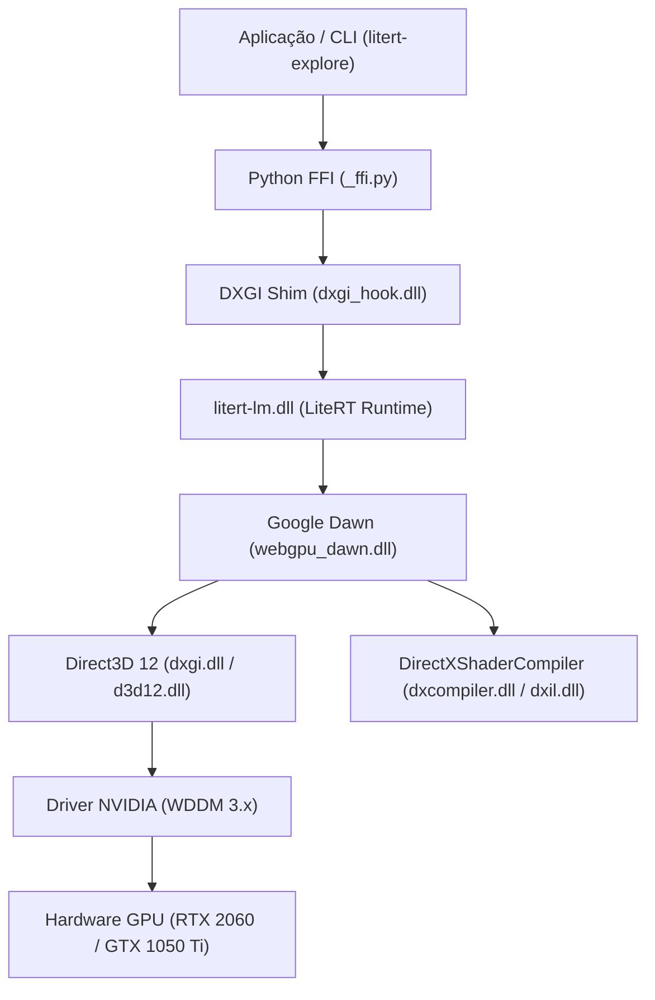

# Arquitetura do LiteRT-LM no Windows

## 1. Visão Geral da Stack de Execução

O **LiteRT-LM** (anteriormente parte do TensorFlow Lite / Google AI Edge) implementa uma camada de orquestração de alto desempenho para modelos de linguagem. No Windows, a aceleração de GPU é construída sobre **WebGPU** via **Google Dawn**, despachando comandos para o driver através de **Direct3D 12 (D3D12)**.

## 2. Por que Variáveis CUDA (`CUDA_VISIBLE_DEVICES`) não têm Efeito?

1. **Ausência de Delegate CUDA Upstream**: O LiteRT upstream utiliza delegates para WebGPU, OpenCL, Metal, Vulkan e XNNPACK (CPU). Não há delegate nativo que utilize a API do CUDA (`cudaMalloc`, `cudaLaunchKernel`, etc.).
2. **Camada de Driver**: Como os kernels são compilados em **HLSL/DXIL** pelo **DirectXShaderCompiler (DXC)** e submetidos via Direct3D 12, a biblioteca `nvcuda.dll` nunca é carregada. O subsistema DirectX ignora completamente variáveis de ambiente específicas do ecossistema CUDA.

## 3. O Mecanismo do DXGI Shim

Para permitir a seleção granular da GPU sem alterar o código-fonte C++ do LiteRT ou Dawn:
1. Interceptamos a chamada de enumeração na vtable da interface COM `IDXGIFactory`:
   - `EnumAdapters1` (índice 12 da vtable).
   - `EnumAdapterByGpuPreference` (índice 29 da vtable).
2. Quando a variável `$env:LITERT_GPU_INDEX` estiver definida como `1`:
   - Qualquer consulta ao `Adapter 0` é silenciosamente redirecionada para o `Adapter 1` físico (GTX 1050 Ti).
   - Consultas a adaptadores subsequentes retornam `DXGI_ERROR_NOT_FOUND`.
3. Dessa forma, o Dawn enxerga a máquina como possuindo apenas um único adaptador (a GTX 1050 Ti), alocando todas as texturas, buffers e pipelines de computação nela.
