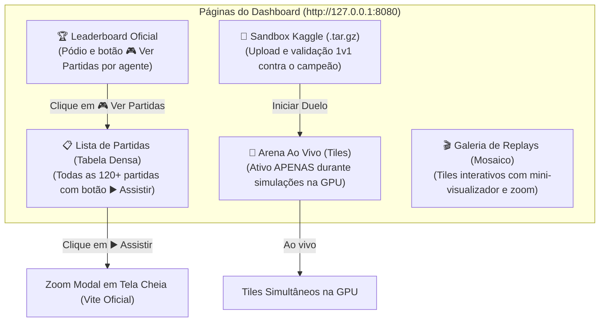

# Dashboard Kaggriculture: Monitor Ao Vivo, Lista de Partidas, Galeria e Sandbox

> **URL de Acesso Local**: [http://127.0.0.1:8080](http://127.0.0.1:8080)  
> **Serviço Backend**: Flask 3.1.3 embutido com streaming de duelos ao vivo e replays  
> **Banco de Dados**: `kaggriculture/data/arena.duckdb` (120+ partidas auditadas)  
> **Diretório de Replays**: `kaggriculture/data/replays/`  
> **Hardware de Decodificação**: NVIDIA GeForce GTX 1050 Ti (GPU 1 via Interceptador DXGI vtable)

---

## 1. As 5 Visões Estruturadas do Dashboard

A interface foi reestruturada em 5 páginas dedicadas para separar monitoramento ao vivo, exploração de dados históricos e experimentação:



---

## 2. Detalhamento de Cada Página

### 1. 🔴 Arena Ao Vivo (`#tab-live`)
- **Foco Estrito**: Reservada exclusivamente para momentos em que duelos estão sendo executados na GPU.
- **Tiles Simultâneos**: Cada duelo em andamento é exibido em um tile dedicado com status `AO VIVO NA GPU`, contagem de moedas e micro-player.
- **Estado de Repouso**: Quando a arena está ociosa, exibe painel limpo com atalhos para lançar rodadas simultâneas ou acessar o sandbox.

### 2. 📋 Lista Completa de Partidas (`#tab-matches`)
- **Tabela Densa sem Miniaturas**: Lista tabular de alta performance com todas as 120 partidas do torneio DuckDB e duelos de sandbox.
- **Filtros e Busca**: Dropdown de estágio (Sprint 72s, Expansion 144s, Scaling 240s, Full Season 720s) e busca em tempo real por nome do agente.
- **Ações por Linha**:
  - **▶️ Assistir Replay**: Abre o visualizador oficial Vite em modal de tela cheia. Caso o replay ainda não estivesse em cache, o backend gera a simulação sob demanda transparentemente.
  - **↗ Nova Janela**: Abre o visualizador em aba dedicada (`/player/<match_id>`).
  - **⬇ JSON**: Download do arquivo de replay bruto.

### 3. 🎬 Galeria de Replays em Tiles (`#tab-gallery`)
- Mosaico de cartões com mini-visualizadores interativos do Kaggriculture para exploração visual de replays salvos.
- Permite clicar em qualquer tile para expandir via modal com zoom ou abrir em nova aba.

### 4. 🏆 Leaderboard Oficial & Estatísticas (`#tab-leaderboard`)
- Pódio visual com os três campeões dialéticos:
  - 🥇 **Labor Magnate** (Campeão do Torneio Suíço / 72 pontos / 18 vitórias)
  - 🥈 **Sprint Rusher** (Campeão de Elo / Peak 694.9 / 97.5% invicto)
  - 🥉 **Land Baron** (Campeão de Capital Econômico / 104.100 moedas)
- Tabela detalhada de ratings, aproveitamento e saldo acumulado.
- Botão **🎮 Ver Partidas (N)** em cada agente para filtrar instantaneamente a Lista de Partidas e assistir seus confrontos.

### 5. 🚀 Sandbox de Validação Kaggle (`#tab-sandbox`)
- Aceita pacotes `submission.tar.gz`, `submission.zip` ou scripts `.py`.
- Descompacta em ambiente isolado, localiza `main.py` e executa contra o adversário escolhido.
- Transfere o foco para a **Arena Ao Vivo** para acompanhar a execução em tempo real na GPU.

---

## 3. Comandos Operacionais

```powershell
# Iniciar o servidor
powershell -File scripts/run_dashboard.ps1

# Ou diretamente via UV
uv run litert-dashboard
```
