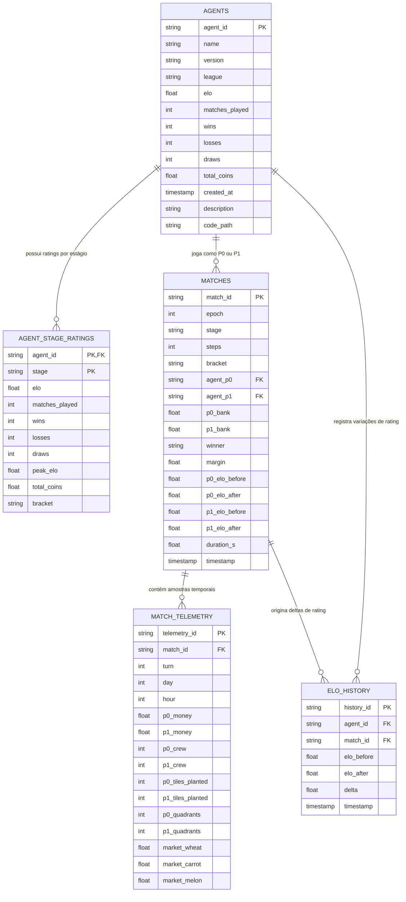

# Especificação Técnica do DuckDB: Replays, Telemetria e Dinâmica de Torneio

> **Ambiente Operacional**: Windows NT (PowerShell / Direct3D 12)  
> **Workspace Raiz**: `kaggriculture-agent-arena`  
> **Arquivo do Banco DuckDB**: `kaggriculture/data/arena.duckdb`  
> **Hardware de Amostragem**: NVIDIA GeForce GTX 1050 Ti (GPU 1 via DXGI Shim)  
> **Finalidade do Documento**: Fornecer a especificação técnica completa do banco de dados, da topologia de arquivos em disco, do esquema relacional, da metodologia do torneio suíço e do mecanismo de captura de replays da arena.

---

## 1. Topologia de Arquivos e Localização Física

A estrutura do projeto está organizada com separação estrita entre o runtime de inferência, o banco de dados analítico, a orquestração do torneio e os debriefings científicos:

```text
kaggriculture-agent-arena/
├── kaggriculture\
│   ├── data\
│   │   └── arena.duckdb            # [BANCO PRINCIPAL] Replays, telemetria, Elos e partidas
│   ├── db\
│   │   └── schema.py               # Definição das tabelas DuckDB, inserções e queries
│   ├── arena\
│   │   ├── arena_engine.py         # Motor de execução de duelos, concorrência e amostragem
│   │   ├── elo.py                  # Formulação matemática do Elo com K-fator dinâmico
│   │   ├── matchmaking.py          # Algoritmo de emparceiramento do Sistema Suíço
│   │   ├── stages.py               # Definições dos 4 estágios temporais (Sprint, Expansion, etc.)
│   │   └── leagues.py              # Critérios de promoção e demoção de ligas
│   ├── agents\
│   │   ├── personality_agent.py    # Factory macro H48-Hybrid e H24 com dual-engine
│   │   ├── llm_player.py           # Pool dual-engine (Engine 0 / Engine 1) na GTX 1050 Ti
│   │   ├── llm_sprint_rusher.py    # Agente H48-Hybrid: Trigo rápido
│   │   ├── llm_labor_magnate.py    # Agente H48-Hybrid: Cadência de ação e trabalho
│   │   ├── llm_land_baron.py       # Agente H48-Hybrid: Conservação de capital
│   │   ├── llm_market_arbitrageur.py# Agente H24: Macro diário de arbitragem
│   │   ├── llm_cautious_farmer.py  # Agente H24: Macro diário de cenoura
│   │   └── llm_melon_monopolist.py # Agente H48-Hybrid: Viés de melão
│   ├── dream\
│   │   ├── dream_loop.py           # Loop principal das 10 épocas e warm-up dos engines
│   │   └── dream_rsi.py            # Motor de introspecção reflexiva pós-época
│   ├── notes\                      # [DEBRIEFINGS] NOTE_epoch_001.md até NOTE_epoch_010.md
│   └── personalities\              # Worldviews originais em Markdown
├── shims\
│   ├── dxgi_hook.cpp               # Interceptador C++ vtable para isolar GPU 1
│   └── dxgi_hook.dll               # Binário compilado da shim DXGI
└── docs\
    └── relatorio_final_arena_10_epocas_dream_rsi.md # Relatório oficial consolidado
```

---

## 2. Arquitetura do DuckDB e Por que Ele foi Escolhido

O DuckDB opera como um motor analítico colunar embutido (*in-process OLAP*). Suas vantagens críticas para este pipeline de dados e posterior treinamento de modelos de linguagem:

1. **Zero Overhead de Infraestrutura**: Não exige serviço em segundo plano, sockets de rede ou credenciais. O arquivo `arena.duckdb` reside diretamente no sistema de arquivos local do Windows.
2. **Armazenamento Colunar Vetorizado**: Consultas agregadas sobre centenas de milhares de passos e transações de mercado executam em microsegundos via SIMD.
3. **Interoperabilidade Direta com Machine Learning**: Permite converter qualquer consulta SQL diretamente para DataFrames do Polars, Pandas ou tabelas PyArrow com cópia zero de memória (*zero-copy*):
   ```python
   import duckdb
   con = duckdb.connect("kaggriculture/data/arena.duckdb", read_only=True)
   arrow_table = con.execute("SELECT * FROM match_telemetry").arrow()
   polars_df = con.execute("SELECT * FROM matches WHERE winner != 'Draw'").pl()
   con.close()
   ```

---

## 3. Esquema Relacional e Dicionário de Dados

O banco de dados é estruturado em 6 tabelas relacionais interconectadas:



### Especificação Detalhada das Tabelas

#### A. Tabela `matches` (120 registros)
Registra o desfecho consolidado de cada partida do torneio:
- `match_id` (`VARCHAR`, PK): Identificador único no formato `m_{epoch}_{stage}_{bracket}_{p0}_vs_{p1}_{idx}` (ex: `m_1_Sprint_Swiss_llm_sprint_rusher_v1_vs_llm_cautious_farmer_v1_1`).
- `epoch` (`INTEGER`): Número da época evolutiva do Dream-RSI (1 a 10).
- `stage` (`VARCHAR`): Estágio de horizonte (`Sprint`, `Expansion`, `Scaling`, `FullSeason`).
- `steps` (`INTEGER`): Quantidade total de turnos da partida (72, 144, 240 ou 720).
- `agent_p0` / `agent_p1` (`VARCHAR`): IDs dos competidores na posição de Player 0 e Player 1.
- `p0_bank` / `p1_bank` (`DOUBLE`): Faturamento final em moedas acumulado em cada fazenda.
- `winner` (`VARCHAR`): ID do agente vencedor ou `'Draw'` em caso de empate de saldo.
- `margin` (`DOUBLE`): Diferença absoluta de moedas entre vencedor e perdedor.
- `p0_elo_before`, `p0_elo_after`, `p1_elo_before`, `p1_elo_after` (`DOUBLE`): Estado do Elo antes e depois do duelo.
- `duration_s` (`DOUBLE`): Tempo de relógio de parede para completar a simulação na GPU.

#### B. Tabela `match_telemetry` (630 registros)
Armazena o estado interno da simulação em checagens temporais estratégicas (viradas de dia, pontos de expansão de plantio e fim de jogo):
- `turn` (`INTEGER`): Turno exato do jogo (0 a 719).
- `day` / `hour` (`INTEGER`): Tempo no calendário da fazenda (`day = turn // 24`, `hour = turn % 24`).
- `p0_money` / `p1_money` (`DOUBLE`): Saldo líquido de caixa em conta corrente no momento da amostra.
- `p0_crew` / `p1_crew` (`INTEGER`): Quantidade de trabalhadores contratados operando na fazenda.
- `p0_tiles_planted` / `p1_tiles_planted` (`INTEGER`): Quantidade de parcelas de terra cultivadas ativas.
- `p0_quadrants` / `p1_quadrants` (`INTEGER`): Quantidade de quadrantes territoriais desbloqueados (1 a 4).
- `market_wheat`, `market_carrot`, `market_melon` (`DOUBLE`): Cotação de mercado em tempo real para cada cultura.

#### C. Tabela `elo_history` (240 registros)
Trilha auditável passo a passo da evolução temporal do rating de cada agente após cada confronto ($\Delta \text{Elo}$).

#### D. Tabela `agent_stage_ratings` (24 registros)
Matriz que dissocia a competência por escala de horizonte temporal. Cada agente possui 4 registros independentes (um para cada estágio), permitindo avaliar onde cada arquitetura é especialista.

---

## 4. Metodologia do Torneio Suíço e Amostragem de Replays

### O Algoritmo de Emparceiramento Suíço
Implementado em `kaggriculture/arena/matchmaking.py`, o emparceiramento segue regras formais de torneio:
1. **Ordenação por Competência**: Os competidores são ordenados descendentemente pelo Elo atual no respectivo estágio.
2. **Pareamento de Vizinhos Mais Próximos**: O agente de maior ranking busca o adversário com Elo mais próximo ainda disponível.
3. **Anti-Repetição Condicional**: O algoritmo consulta o conjunto `played_pairs` daquela fase para priorizar adversários inéditos, garantindo que o espaço de amostragem cubra múltiplos confrontos cruzados.
4. **Convergência para o Topo**: Conforme as épocas avançam, os agentes com alto índice de vitórias se enfrentam repetidamente na mesa 1 (como ocorreu entre `sprint_rusher`, `land_baron` e `labor_magnate`), enquanto agentes em crise de liquidez são isolados na chave inferior.

### Os 4 Estágios de Horizonte (Currículo de Complexidade)
Definidos em `kaggriculture/arena/stages.py`:
1. **Sprint (72 passos / 3 dias)**: Foco em liquidez rápida de trigo e cenoura. Requer início imediato sem hesitação.
2. **Expansion (144 passos / 6 dias)**: Transição para o segundo ciclo de plantio e teste de fluxo contínuo de caixa.
3. **Scaling (240 passos / 10 dias)**: Acumulação de capital para compras de maior margem e primeiros testes de escala.
4. **Full Season (720 passos / 30 dias)**: Teste extremo de endurance macroeconômico, gestão contínua de ervas daninhas, rotação de solo e colheita em larga escala.

---

## 5. Formulação Matemática do Sistema de Rating Elo

O cálculo de atualização de rating está implementado em `kaggriculture/arena/elo.py`.

### 1. Probabilidade Esperada de Vitória (Curva Logística)
Dado o competidor $A$ com rating $R_A$ e o competidor $B$ com rating $R_B$, a pontuação esperada $E_A$ para o jogador $A$ é definida por:

$$
E_A = \frac{1}{1 + 10^{(R_B - R_A)/400}}
$$

E reciprocamente:

$$
E_B = 1.0 - E_A
$$

### 2. Fator $K$ Dinâmico com Maturação de Amostragem
Para assegurar calibração rápida nas primeiras partidas e estabilização assintótica nas rodadas finais, o fator $K$ varia dinamicamente conforme o número de partidas disputadas pelo agente ($N$):

$$
K(N) = \begin{cases} 40.0, & \text{se } N < 10 \\ 24.0, & \text{se } 10 \le N < 30 \\ 16.0, & \text{se } N \ge 30 \end{cases}
$$

### 3. Equação de Atualização de Rating
Após a resolução da partida, com resultado $S_A \in \{1.0 \text{ (vitória)}, 0.5 \text{ (empate)}, 0.0 \text{ (derrota)}\}$:

$$
R'_A = \max(100.0, R_A + K(N_A) \times (S_A - E_A))
$$

$$
R'_B = \max(100.0, R_B + K(N_B) \times (S_B - E_B))
$$

O piso mínimo de rating é garantido em 100.0 para prevenir degeneração numérica.

---

## 6. Como os Replays Foram Capturados da Arena

Durante a execução das 10 épocas na GTX 1050 Ti:
1. **Inferência Neural Estruturada**: Em cada ponto de decisão, o agente invocava o LiteRT-LM (Gemma 4 E2B) com `generate_structured` via `LL_GUIDANCE`, emitindo um plano macro em JSON válido:
   ```json
   {
     "actions": ["NORTH", "PLANT_WHEAT", "WATER", "WATER", "HARVEST", "DROP"],
     "market_seed": "WHEAT"
   }
   ```
2. **Fila de Execução Autônoma**: As ações eram enfileiradas e executadas na simulação Kaggle Environments passo a passo.
3. **Gatilhos Reativos com Debounce**: Se uma erva daninha nascia no ladrilho ou a colheita ficava madura, o filtro debounce (12 passos) permitia ao agente interromper a fila e replanejar.
4. **Sincronização com o DuckDB**: Em cada intervalo de amostragem e no fechamento do duelo, a função `record_stage_match` congelava o estado das fazendas e gravava as tuplas relacionais de forma atômica no arquivo `arena.duckdb`.


