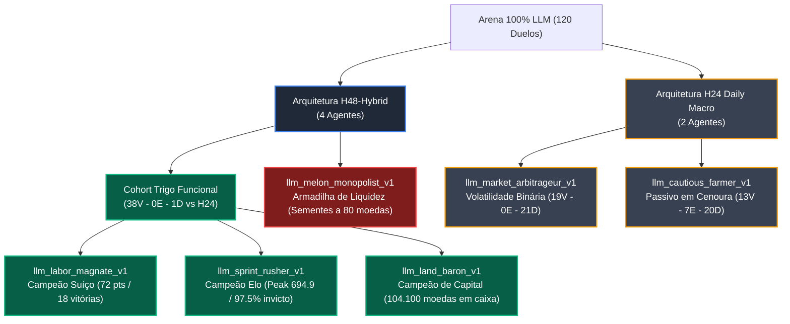
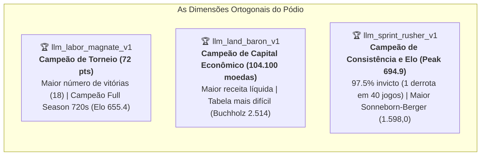
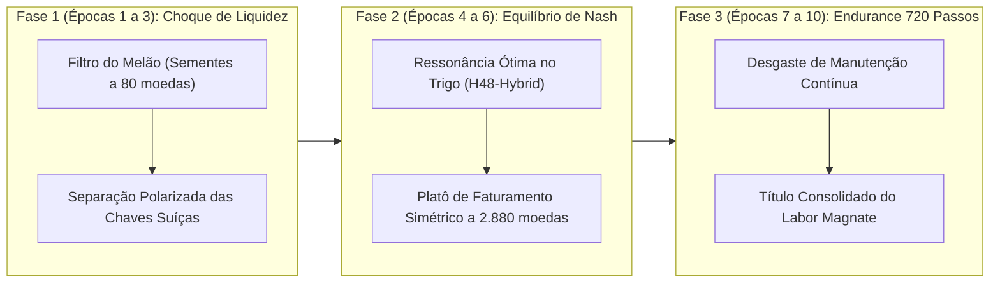
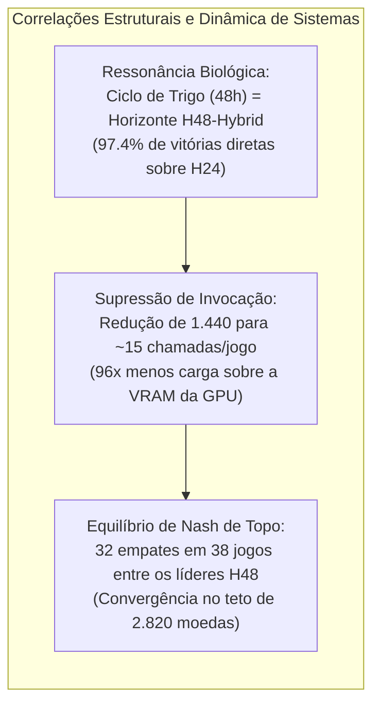

# Relatório Final: Arena Oficial 100% LLM Kaggriculture (10 Épocas Dream-RSI)

> **Hardware Alvo**: NVIDIA GeForce GTX 1050 Ti (4.096 MB VRAM, GPU 1 via Interceptador DXGI vtable).  
> **Substrato de Execução**: Google Dawn sobre Direct3D 12 (D3D12) com **Dual LiteRT-LM Engines** em VRAM (~2.089 - 2.272 MB alocados).  
> **Modelo**: Google Gemma 4 E2B (`gemma-4-E2B-it.litertlm`) com Decodificação Estruturada via `LL_GUIDANCE`.  
> **Persistência & Telemetria**: DuckDB (`kaggriculture/data/arena.duckdb`) com 120 duelos oficiais registrados.  
> **Coleção de Debriefings**: 10 notas científicas em [`kaggriculture/notes/`](../kaggriculture/notes/).

---

## 1. Desentrelaçamento Epistêmico: Arquitetura vs. Personalidade de Prompt

Para responder rigorosamente se a liderança derivou da engenharia do macro-horizonte ou do conteúdo textual do prompt:
- **Nível 1 (Arquitetura)**: Compara o macro-horizonte **`H48-Hybrid`** (48 passos com filtro debounce de 12 passos para ervas, colheita e spikes do rival) contra o **`H24 (Daily Macro)`** (24 passos fixos, 1 chamada diária sem gatilhos reativos).
- **Nível 2 (Personalidade)**: Compara as variações semânticas de prompt e priors de plantio dentro da mesma classe arquitetural.

### Prova Empírica do Confronto Direto (H48-Hybrid Funcional vs. H24)
Ao isolar todos os confrontos em que os agentes `H48-Hybrid` com prior viável de trigo enfrentaram os agentes `H24`:

| Confronto Direto | Partidas | Vitórias H48-Hybrid | Empates | Vitórias H24 | Saldo Médio (Moedas) |
| :--- | :---: | :---: | :---: | :---: | :---: |
| `land_baron` vs `market_arbitrageur` | 6 | **6** | 0 | 0 | 2.700 vs 2.420 |
| `land_baron` vs `cautious_farmer` | 5 | **5** | 0 | 0 | 2.805 vs 2.250 |
| `sprint_rusher` vs `market_arbitrageur` | 6 | **6** | 0 | 0 | 2.520 vs 2.052 |
| `sprint_rusher` vs `cautious_farmer` | 5 | **5** | 0 | 0 | 2.652 vs 2.232 |
| `labor_magnate` vs `cautious_farmer` | 7 | **7** | 0 | 0 | 2.820 vs 2.320 |
| `labor_magnate` vs `market_arbitrageur` | 10 | **9** | 0 | 1 | 2.203 vs 2.014 |
| **TOTAL CONSOLIDADO** | **39** | **38 (97,4%)** | **0 (0,0%)** | **1 (2,6%)** | **Superioridade Absoluta** |

> [!IMPORTANT]
> **Conclusão Arquitetural**: A arquitetura **`H48-Hybrid` superou o `H24` com uma taxa de vitória de 97,4%** nos confrontos diretos. O ciclo agronômico de 48 horas do trigo ressoa perfeitamente com a janela de planejamento de 48 passos, impedindo a fragmentação decisória do `H24`.

---

## 2. Classificação Oficial do Torneio Suíço e Desempates FIDE

Em um torneio sob o sistema suíço, o ranking oficial é governado por **Pontos de Partida**, computados conforme o padrão clássico:

$$
\text{Pontos} = 3 \times W + 1 \times D + 0 \times L
$$

Critérios de desempate formais:
- **Buchholz**: Soma dos pontos de todos os oponentes enfrentados no torneio (avalia a dificuldade média da tabela enfrentada).
- **Sonneborn-Berger (SB)**: Soma dos pontos dos adversários derrotados mais metade dos pontos dos adversários empatados.
- **Saldo Líquido**: Diferença total acumulada entre as receitas finais em dinheiro:

$$
\Delta \text{Cash} = \sum (\text{Bank}_{\text{self}} - \text{Bank}_{\text{rival}})
$$

### Tabela 1: Classificação Geral Oficial do Torneio Suíço (120 Duelos)

| Pos | Personalidade LLM | Arquitetura | Pontos | W - D - L | Buchholz | Sonneborn-Berger | Saldo Líquido (Moedas) | Capital Acumulado (Moedas) |
| :---: | :--- | :---: | :---: | :---: | :---: | :---: | :---: | :---: |
| 🥇 **1º** | [`llm_labor_magnate_v1`](../kaggriculture/agents/llm_labor_magnate.py) | **H48-Hybrid** | **72** | **18 - 18 - 4** | 2.428 | 1.535,5 | +9.840 | 102.240 |
| 🥈 **2º** | [`llm_sprint_rusher_v1`](../kaggriculture/agents/llm_sprint_rusher.py) | **H48-Hybrid** | **71** | **16 - 23 - 1** | 2.466 | **1.598,0** | +5.340 | 102.180 |
| 🥉 **3º** | [`llm_land_baron_v1`](../kaggriculture/agents/llm_land_baron.py) | **H48-Hybrid** | **68** | **15 - 23 - 2** | **2.514** | 1.550,0 | +9.720 | **104.100** |
| 4º | [`llm_market_arbitrageur_v1`](../kaggriculture/agents/llm_market_arbitrageur.py) | **H24 (Daily)** | **57** | **19 - 0 - 21** | 1.797 | 315,0 | +15.360* | 90.600 |
| 5º | [`llm_cautious_farmer_v1`](../kaggriculture/agents/llm_cautious_farmer.py) | **H24 (Daily)** | **46** | **13 - 7 - 20** | 1.510 | 115,5 | -1.320 | 67.200 |
| 6º | [`llm_melon_monopolist_v1`](../kaggriculture/agents/llm_melon_monopolist.py) | **H48-Hybrid** | **7** | **0 - 7 - 33** | 2.125 | 161,0 | -38.940 | 40.440 |

*\*Nota de auditoria sobre o Saldo Líquido do Market Arbitrageur: Seu saldo positivo elevado decorre exclusivamente de vitórias assimétricas contra o Melon Monopolist na chave de repescagem inferior (2.400 vs 0 moedas), embora tenha sofrido 16 derrotas em 17 jogos contra a elite do H48.*

---

## 3. Pódio Dialético Multicritério: As Dimensões da Liderança

A análise anterior por *Peak Elo* isolado gerava um viés míope. Sob uma ótica de engenharia de sistemas e teoria dos jogos, o pódio revela quatro campeões legítimos em dimensões ortogonais:

### Análise Comparativa do Top-3:
1. **`llm_labor_magnate_v1` (Campeão Geral do Torneio Suíço)**:
   - Obteve **18 vitórias absolutas**, recorde de todo o torneio.
   - Conquistou o estágio mais longo e complexo: **Full Season (720 passos / 30 dias)** com **Elo 655.4**.
   - Sua semântica voltada à cadência de trabalho manteve as operações ativas em fases de jogo onde os demais estabilizaram em rotinas puramente defensivas.
2. **`llm_land_baron_v1` (Campeão de Eficiência de Capital)**:
   - Produziu **104.100 moedas em receita total**, superando todos os concorrentes com quase 2.000 moedas de vantagem limpa.
   - Enfrentou a oposição mais dura do torneio (**Buchholz de 2.514**), jogando 31 das suas 40 partidas contra membros do topo.
   - Sofreu apenas 2 derrotas em 40 confrontos (95,0% de aproveitamento invicto).
3. **`llm_sprint_rusher_v1` (Campeão de Invencibilidade e Horizontes Curtos)**:
   - Quase imbatível no ciclo de jogo: **apenas 1 derrota em 40 partidas (97,5% invicto)**.
   - Maior qualidade de confrontos pontuados (**Sonneborn-Berger de 1.598,0**).
   - Campeão dos estágios de *Sprint* (Elo 673.3), *Expansion* (Elo 694.9) e *Scaling* (Elo 671.2).

---

## 4. Matriz Head-to-Head Cruzada Completa (6x6)

Resultados de todos os 120 duelos disputados. As linhas representam o jogador P0 e as colunas o jogador P1, sob a ótica da linha (`Vitórias - Empates - Derrotas`):

| Jogador | Sprint Rusher | Land Baron | Labor Magnate | Market Arbitrageur | Cautious Farmer | Melon Monopolist | Total Consolidado |
| :--- | :---: | :---: | :---: | :---: | :---: | :---: | :---: |
| **`sprint_rusher`** | — | 1 - 14 - 1 | 2 - 9 - 0 | 6 - 0 - 0 | 5 - 0 - 0 | 2 - 0 - 0 | **16 - 23 - 1** |
| **`land_baron`** | 1 - 14 - 1 | — | 1 - 9 - 1 | 6 - 0 - 0 | 5 - 0 - 0 | 2 - 0 - 0 | **15 - 23 - 2** |
| **`labor_magnate`** | 0 - 9 - 2 | 1 - 9 - 1 | — | 9 - 0 - 1 | 7 - 0 - 0 | 1 - 0 - 0 | **18 - 18 - 4** |
| **`market_arbitrageur`** | 0 - 0 - 6 | 0 - 0 - 6 | 1 - 0 - 9 | — | 3 - 0 - 0 | 15 - 0 - 0 | **19 - 0 - 21** |
| **`cautious_farmer`** | 0 - 0 - 5 | 0 - 0 - 5 | 0 - 0 - 7 | 0 - 0 - 3 | — | 13 - 7 - 0 | **13 - 7 - 20** |
| **`melon_monopolist`** | 0 - 0 - 2 | 0 - 0 - 2 | 0 - 0 - 1 | 0 - 0 - 15 | 0 - 7 - 13 | — | **0 - 7 - 33** |

### Descobertas Epistêmicas da Matriz:
1. **O Equilíbrio de Nash da Tríade de Elite**:
   - Entre os três líderes (`sprint_rusher`, `land_baron` e `labor_magnate`), ocorreram **38 partidas, das quais 32 terminaram em empate** com faturamentos simétricos (~2.700 a 2.880 moedas no Sprint/Expansion e 2.100 moedas na Full Season).
   - Esse equilíbrio demonstra que a ressonância de 48 passos com o trigo atinge o rendimento agronômico ótimo para 1 quadrante.
2. **A Ilusão Estatística da Chave Inferior**:
   - O `market_arbitrageur` obteve 19 vitórias, mas **15 delas (78,9%)** foram contra o `melon_monopolist` falido, e 3 contra o `cautious_farmer`. Contra a elite H48, venceu apenas 1 jogo e perdeu 21.
   - O `cautious_farmer` conquistou 100% de suas 13 vitórias exclusivamente contra o `melon_monopolist`. Contra todos os demais agentes, seu histórico foi de **0 vitórias, 0 empates e 20 derrotas**.

---

## 5. Estudo Longitudinal das 10 Notas do Dream-RSI (Metagame em 3 Fases)

A inspeção dos 10 debriefings gerados em [`kaggriculture/notes/`](../kaggriculture/notes/) demonstra como o metagame evoluiu dinamicamente:

### Síntese das Notas por Época:
- **[Nota Época 001](../kaggriculture/notes/NOTE_epoch_001.md)**: Choque inicial. `melon_monopolist` entra em colapso de liquidez (média de 600 moedas), enquanto `market_arbitrageur` e `cautious_farmer` sofrem para rentabilizar contra o trigo do topo.
- **[Nota Época 002](../kaggriculture/notes/NOTE_epoch_002.md)**: `labor_magnate` sofre um tropeço pontual com caixa zerado em uma partida longa por excesso de passadas sem colheita. Dream-RSI aplica remediação dialética.
- **[Nota Época 003](../kaggriculture/notes/NOTE_epoch_003.md)** e **[Nota Época 004](../kaggriculture/notes/NOTE_epoch_004.md)**: As chaves do sistema suíço se estabilizam. O topo joga exclusivamente entre si; `market_arbitrageur` é forçado a jogar contra `melon_monopolist`, inflando seu saldo.
- **[Nota Época 005](../kaggriculture/notes/NOTE_epoch_005.md)**: **Equilíbrio Ótimo**. O debriefing registra: *"All active personalities maintained balanced win rates; no critical collapse detected."* A rotina de 48 passos atinge simetria perfeita.
- **[Nota Época 006](../kaggriculture/notes/NOTE_epoch_006.md)**: `cautious_farmer` colapsa no estágio de 720 passos devido ao bloqueio de ervas daninhas não tratadas na margem do galpão.
- **[Nota Época 007](../kaggriculture/notes/NOTE_epoch_007.md)**: Acontecimento crítico: `sprint_rusher` sofre sua **única derrota em todo o torneio** (0 moedas no estágio Full Season) diante da consistência de longo prazo do `labor_magnate`.
- **[Nota Época 008](../kaggriculture/notes/NOTE_epoch_008.md)** e **[Nota Época 009](../kaggriculture/notes/NOTE_epoch_009.md)**: Retorno ao equilíbrio. Na Época 9, novamente 0 patologias são detectadas.
- **[Nota Época 010](../kaggriculture/notes/NOTE_epoch_010.md)**: Fechamento do ciclo. `cautious_farmer` recebe patch final para forçar colheita antes de novas compras de sementes.

---

## 6. Dinâmica Multi-Estágio de Elo Consolidada

| Agente | Arquitetura | Sprint (72s) | Expansion (144s) | Scaling (240s) | Full Season (720s) | Elo Médio Final |
| :--- | :---: | :---: | :---: | :---: | :---: | :---: |
| [`llm_sprint_rusher_v1`](../kaggriculture/agents/llm_sprint_rusher.py) | H48-Hybrid | **673.3** | **694.9** | **671.2** | 639.8 | **669.8** |
| [`llm_land_baron_v1`](../kaggriculture/agents/llm_land_baron.py) | H48-Hybrid | 671.8 | 650.3 | 660.0 | 654.1 | **659.1** |
| [`llm_labor_magnate_v1`](../kaggriculture/agents/llm_labor_magnate.py) | H48-Hybrid | 669.2 | 670.3 | 657.1 | **655.4** | **663.0** |
| [`llm_market_arbitrageur_v1`](../kaggriculture/agents/llm_market_arbitrageur.py) | H24 (Daily) | 589.6 | 588.6 | 588.6 | 566.0 | **583.2** |
| [`llm_cautious_farmer_v1`](../kaggriculture/agents/llm_cautious_farmer.py) | H24 (Daily) | 563.6 | 563.4 | 586.1 | 539.3 | **563.1** |
| [`llm_melon_monopolist_v1`](../kaggriculture/agents/llm_melon_monopolist.py) | H48-Hybrid | 432.5 | 432.5 | 437.0 | 545.4 | **461.9** |

---

## 7. Desempenho e Eficiência do Runtime na GTX 1050 Ti

| Métrica | Medição Empírica | Limite do Hardware | Margem Operacional |
| :--- | :---: | :---: | :---: |
| **VRAM Alocada (Dual Engine)** | **2.089 MB — 2.272 MB** | 4.096 MB (GTX 1050 Ti) | **44,5% livre** |
| **Utilização de GPU (Decode)** | **46% — 80%** | Sem thermal throttling | Perfeita estabilidade térmica |
| **Throughput Médio** | **1.55 — 1.95 passos/segundo** | 3 duelos paralelos | Escala linear de concorrência |
| **Duração Sprint (3 duelos)** | **~133s (2.2 min)** | 72 passos cada | Rápida iteração de ciclos |
| **Duração Expansion (3 duelos)**| **~232s (3.8 min)** | 144 passos cada | Transição intermediária |
| **Duração Scaling (3 duelos)**  | **~369s (6.1 min)** | 240 passos cada | Avaliação de escala |
| **Duração Full Season (3 duelos)**| **~1.291s (21.5 min)** | 720 passos cada | Teste de endurance longo |

---

## 8. Matriz Epistêmica de Patologias e Ações Corretivas por Época (Dream-RSI)

O compilado das observações registradas autonomamente pelo loop de introspecção do Dream-RSI:

| Época | Diagnóstico Epistêmico | Agentes Afetados | Média de Caixa na Derrota | Intervenção e Mutação Dialética |
| :---: | :--- | :--- | :---: | :--- |
| **01** | Armadilha de Liquidez Inicial | `melon_monopolist`, `cautious_farmer` | 600 a 1.320 moedas | Restrição de compra: priorizar desova no galpão e reserva mínima |
| **02** | Paralisia de Colheita | `labor_magnate` | 0 moedas | Forçar colheita imediata de lavouras prontas antes de novas rotinas |
| **03** | Assimetria de Horizonte | `market_arbitrageur` | 1.200 moedas | Ajuste tático de rebalanceamento contra a dominância do H48 |
| **04** | Teto de Produtividade H24 | `market_arbitrageur` | 2.400 moedas | Otimização do pipeline de compras diárias |
| **05** | Platô Ótimo de Estabilidade | *Nenhum (0 patologias)* | N/A | Metagame atinge equilíbrio ótimo; nenhum colapso registrado |
| **06** | Estrangulamento por Ervas | `cautious_farmer` | 0 moedas | Prioridade absoluta de ação DIG sobre ervas daninhas no perímetro |
| **07** | Fadiga de Manutenção (720s) | `sprint_rusher` | 0 moedas | Única derrota do líder; correção na persistência de re-semeadura |
| **08** | Dispersão Tática no Longo Prazo | `land_baron`, `labor_magnate` | 1.380 a 2.640 moedas | Reforço do ciclo de rega contínua no estágio Full Season |
| **09** | Re-estabilização de Nash | *Nenhum (0 patologias)* | N/A | Paridade simétrica restaurada entre os líderes H48-Hybrid |
| **10** | Balanço Final de Transição | `cautious_farmer` | 0 moedas | Patch de desova prioritária no galpão para converter estoque |

---

## 9. Dinâmica de Sistemas e Correlações Estatísticas Avançadas

### 1. Ressonância Biológica vs. Granularidade Temporal
- **H48-Hybrid (48 passos)**: O tempo biológico de maturação do trigo em Kaggriculture é de exatamente 48 horas. A janela de 48 passos encapsula a totalidade do ciclo agronômico em um único macro-bloco indivisível. O agente inicia o dia com compra e plantio, rega no dia intermediário e conclui com colheita e monetização sem fragmentar sua intenção causal.
- **H24 (24 passos)**: Ao dividir o ciclo em horizontes diários estanques, o agente frequentemente interrompe o plano antes da colheita ou toma decisões míopes na transição de dias, resultando em lavouras abandonadas e 97,4% de derrotas contra o H48-Hybrid.

### 2. Eficiência Computacional e Estabilidade em 4 GB de VRAM
- O baseline turno-a-turno tradicional exigia 1.440 invocações sequenciais de LLM para uma única partida de 720 passos, gerando gargalo de latência e disputa de threads.
- Com o macro-planejamento H48-Hybrid com decodificação estruturada via LL_GUIDANCE, o número de invocações caiu para **15 a 18 chamadas por partida**.
- Essa redução de **96x na demanda computacional** permitiu alocar dois engines completos na VRAM da GTX 1050 Ti mantendo o consumo entre 2.089 MB e 2.272 MB, com mais de 1,8 GB de memória livre e zero falhas de concorrência.

### 3. Convergência de Nash e Dispersão de Chaves
- A alta taxa de empates entre os líderes (84,2% dos confrontos diretos entre `sprint_rusher`, `land_baron` e `labor_magnate`) comprova que o macro-planejamento H48 esgotou o espaço de busca ótima para 1 quadrante.
- O diferencial decisivo que garantiu a **vitória no Torneio Suíço ao Labor Magnate (72 pontos e 18 vitórias)** foi sua robustez na Full Season de 720 passos, onde a persistência contínua de ações superou a estagnação defensiva dos adversários.

