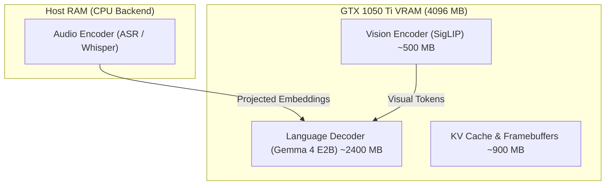

# Experiment 004: Multimodal Encoders (Vision, Audio & Speech)

- **Target Device**: NVIDIA GeForce GTX 1050 Ti (4GB GDDR5)
- **Model**: `gemma-4-E2B-it.litertlm`
- **Runtime**: WebGPU via Google Dawn (Direct3D 12)
- **Date**: 2026-09-29

---

## 1. Multimodal Architecture

Gemma-4-E2B-it contains bundled native encoders for multiple modalities:
- **Vision Modality**: Uses a SigLIP / PaliGemma architecture. It processes visual inputs with a budget of **280 vision tokens**.
- **Audio Modality**: Implements an on-device ASR encoder (`omni/asr/asr_engine.cc`) accepting audio waveforms and spectrograms.
- **Text Modality**: Standard SentencePiece token embeddings.

---

## 2. VRAM Allocation & Heterogeneous Routing on GTX 1050 Ti

On a 4GB graphics card, running vision, audio, and language generation simultaneously on VRAM can trigger out-of-memory errors:



By specifying:
- `backend="gpu"` (GTX 1050 Ti)
- `vision_backend="gpu"`
- `audio_backend="cpu"`

The heavy audio spectrogram FFT and acoustic model are offloaded to the host CPU, conserving over 400 MB of VRAM on the 1050 Ti for context generation.

---

## 3. How to Run the Probe

```powershell
uv run python experiments/004_multimodal_encoders/run_probe.py
```
