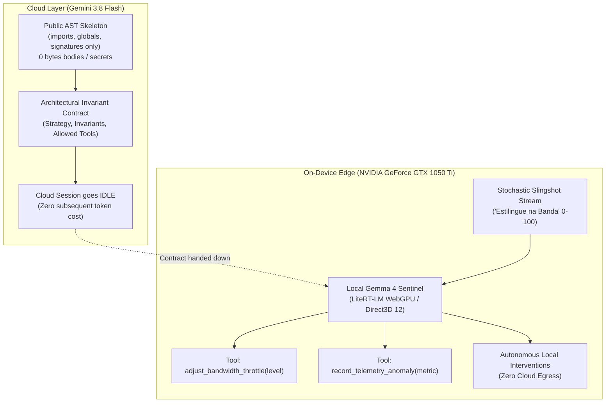

# Experiment 008: Antigravity Hybrid Orchestrator & Local Telemetry Sentinel

- **Target Device**: NVIDIA GeForce GTX 1050 Ti (4GB GDDR5, GPU 1)
- **Model**: `gemma-4-E2B-it.litertlm` (LiteRT-LM pure-text mode)
- **Framework**: `google-antigravity` + `litert-lm` over Google Dawn (Direct3D 12)
- **Date**: 2026-09-29

---

## 1. Architectural Philosophy: Cloud Architect vs. On-Device Sentinel

Inspired by the [Antigravity Hybrid Orchestrator](https://github.com/google-gemma/cookbook/tree/main/apps/antigravity-hybrid-orchestrator) cookbook, this experiment decouples high-level policy contract generation from high-frequency on-device execution:



---

## 2. Privacy & The AST Skeleton Extraction Guarantee

Before transmitting anything to the Cloud Architect, `extract_public_skeleton()` uses Python's standard `ast` module to strip:
- 100% of function/method bodies
- SQL queries and database connection strings
- Hardcoded API tokens and secret literals
- Private helper implementations

Only structural interfaces (`imports`, module `globals`, and `defs`) are exchanged. From these ~40 tokens, the Cloud Architect formulates invariant rules and hands execution over to the on-device workforce.

---

## 3. Stochastic Slingshot Bandwidth Dynamics ("Estilingue na Banda")

Rather than uniform random numbers, telemetry queues in real-world packet buffers and network interfaces experience **slingshot dynamics**:
- **Accumulation Phase**: Low-stress metrics ($10 \le v \le 55$), steady inter-arrival delay (~1.0s).
- **Slingshot Release (Burst Phase)**: Elastic tension snaps, compressing inter-arrival intervals down to $100\text{--}350\text{ ms}$ while metric values surge into critical stress zones ($75 \le v \le 99$).

The local Gemma 4 agent continuously observes this stream on the GTX 1050 Ti, dynamically stepping the queue throttle (`0: Nominal`, `1: Moderate`, `2: Aggressive`) and logging anomalies without incurring cloud roundtrip latency or token costs.

---

## 4. Hardware Constraints on GTX 1050 Ti

- **DXGI Shim Redirection**: Hardware isolation guarantees that all WebGPU / Direct3D 12 pipelines target Adapter 1 (GP107) while bypassing the primary display adapter (RTX 2060).
- **Pure-Text Pipeline**: Audio and vision backends are explicitly uninitialized (`audio_backend=None`, `vision_backend=None`), liberating ~550 MB of VRAM.
- **Speculative Decoding**: Multi-Token Prediction (MTP) drafter signatures (`mtp_drafter` and `verify`) are active to sustain ~44 tokens/s decode speed on 4GB GDDR5.

---

## 5. How to Run the Probe

```powershell
uv run python experiments/008_antigravity_hybrid_orchestrator/run_probe.py
```

---

## 6. Empirical Probe Results (GTX 1050 Ti Pascal GP107)

```text
[LiteRT-LM DXGI Shim] Interceptando adaptadores de GPU:
  - GPU 0: NVIDIA GeForce RTX 2060 (VRAM: 5954 MB) 
  - GPU 1: NVIDIA GeForce GTX 1050 Ti (VRAM: 4004 MB) <= [SELECIONADA]
[LiteRT-LM DXGI Shim] Hook ativo: isolando GPU 1 como unico dispositivo visivel no processo.
Selected adapter: NVIDIA GeForce GTX 1050 Ti, arch=pascal, vendor=nvidia, backend=Direct3D 12
LiteRT-LM Engine successfully resident on GTX 1050 Ti (Init: 2.72s).
```

### Telemetry Stream Decision Log

| Tick | Metric Value | Phase | Action Taken | Throttle Level | Model Explanation |
| :---: | :---: | :---: | :---: | :---: | :--- |
| **1** | 36/100 | Nominal | `NOMINAL` | Level 0 | Telemetry value is nominal and does not trigger any throttle adjustments. |
| **2** | 83/100 | **BURST** | `THROTTLE_APPLIED` | **Level 1** | Throttle elevation is recommended due to the metric value exceeding 80. |
| **3** | 80/100 | **BURST** | `THROTTLE_APPLIED` | **Level 1** | Throttle elevation recommended due to metric value reaching 80 and burst spike detection. |
| **4** | 99/100 | **BURST** | `THROTTLE_APPLIED` | **Level 2** | High telemetry value (99/100) and burst spike triggered aggressive throttle elevation. |
| **5** | 75/100 | **BURST** | `NOMINAL` | Level 0 | Telemetry value is below the threshold for throttle elevation. |
| **6** | 22/100 | Nominal | `NOMINAL` | Level 0 | Telemetry value is nominal and does not trigger any throttle adjustments. |

### On-Device Autonomous Tool Interventions
- `adjust_bandwidth_throttle(1)` dispatched at Tick #2.
- `record_telemetry_anomaly(83)` persisted in local memory.
- `adjust_bandwidth_throttle(2)` dispatched at Tick #4 (spike to 99/100).
- `adjust_bandwidth_throttle(0)` restored once pressure subsided.
- **Zero cloud egress**: Zero private function bodies or secrets left the local node.

