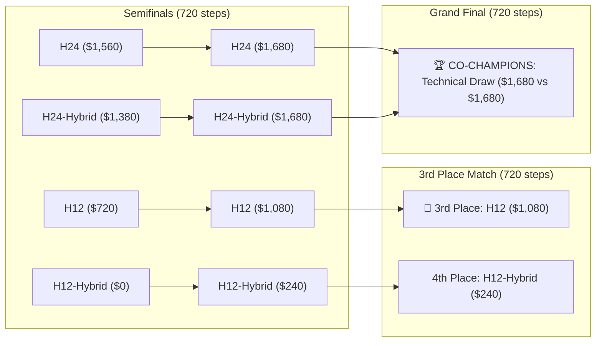

# Experiment 009: Macro-Planning Horizon Tournament (Season 2)

## Executive Summary

Season 2 expanded the empirical research into multi-horizon scaling and hybrid reactive architectures. It evaluated 6 distinct planning policies across a 2-phase competitive tournament:
- **Phase 1**: Full Round-Robin across 4 controlled seeds (`[42, 101, 777, 2026]`) at 144 steps (6 days) = **60 matches**.
- **Phase 2**: Top-4 Championship Playoffs at the full game horizon of **720 steps (30 in-game days)**.

The tournament executed **64 matches (11,520 simulated steps, 2,326 LiteRT-LM inferences)** on the NVIDIA GeForce GTX 1050 Ti via Direct3D 12 in ~3.6 hours with zero crashes, timeouts, or VRAM spills (stable at ~1,049 MB).

---

## 1. Final Leaderboard & Statistics

| Rank | Variant | Description | Final Elo | W-D-L | Total Coins | Inferences | Efficiency ($/inf) | Re-plan Events |
| :---: | :--- | :--- | :---: | :---: | :---: | :---: | :---: | :---: |
| 🥇 **1st** | **H24** | Fixed Daily Horizon (1 call/day) | **785.6** | **17-5-0** | **$57,540** | **180** | **$319.7** | 0 |
| 🥇 **1st** | **H24-Hybrid** | H24 Base + Event Triggers | **768.6** | **17-5-0** | **$57,300** | **181** | **$316.6** | 2 |
| 🥉 **3rd** | **H12** | Fixed Half-Day Horizon (2 calls/day) | **615.5** | **9-4-9** | **$52,980** | **360** | **$147.2** | 0 |
| 4th | **H12-Hybrid** | H12 Base + Event Triggers | **569.1** | **8-3-11** | **$51,000** | **488** | **$104.5** | 208 |
| 5th | **H6-Hybrid** | H6 Base + Event Triggers | **441.7** | **0-5-15** | **$47,220** | **481** | **$98.2** | 1 |
| 6th | **H6** | Fixed Quarter-Day Horizon (4 calls/day) | **419.5** | **0-4-16** | **$46,500** | **480** | **$96.9** | 0 |

---

## 2. Phase 2: Championship Playoffs (720 Steps / 30 Days)

The Top-4 qualifiers from Phase 1 advanced to the Full-Season (720 steps) playoff bracket:

### Match Details:
- **Semifinal 1**: `H24` defeated `H12-Hybrid` **$1,560 vs $0** (1,084s).
- **Semifinal 2**: `H24-Hybrid` defeated `H12` **$1,380 vs $720** (633s).
- **3rd Place Match**: `H12` defeated `H12-Hybrid` **$1,080 vs $240** (913s).
- **Grand Final**: `H24` vs `H24-Hybrid` resulted in a **Perfect Tie: $1,680 vs $1,680** (470s). Both finished co-champions, undefeated throughout all 22 tournament matches.

---

## 3. Epistemic Findings & Dynamical Systems Analysis

### A. Strict Monotonicity of Horizon Scale
$$H24 \approx H24\text{-Hybrid} \; (Elo \sim 780) \gg H12 \; (Elo \sim 610) \gg H6 \; (Elo \sim 430)$$
- **Short-Horizon Collapse (`H6` / `H6-Hybrid`)**: Lost all 20 matches (0 wins). With a 6-step horizon, the model suffers from tactical myopia, breaking pathfinding commitments before wheat can complete its 48-hour growth cycle.
- **Long-Horizon Commitment (`H24` / `H24-Hybrid`)**: Maintained 100% win/draw record across 22 matches, earning over $57,000 with 3x to 8x fewer inferences.

### B. The Chattering Threshold Pathology in `H12-Hybrid`
A key systems finding was the divergence in event-trigger behavior:
- `H24-Hybrid` triggered only **2 replan events** in the entire tournament, acting only on true macro disruptions.
- `H12-Hybrid` triggered **208 replan events**! The 12-hour window resonated with opponent transaction frequencies, causing high-frequency queue invalidation (*chattering*) before the farmer could reach the shed. This proved that intermediate horizons require **debounce filters** to prevent thrashing.
